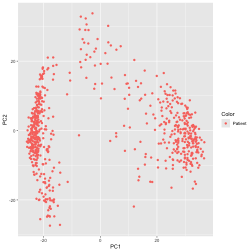
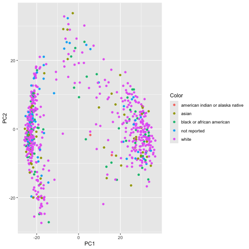
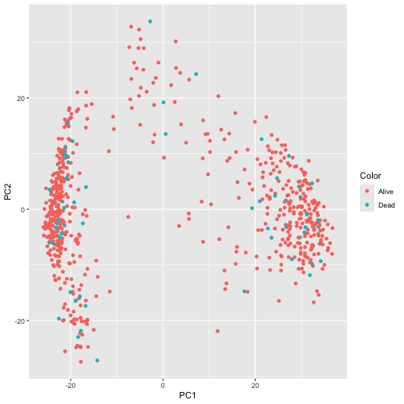
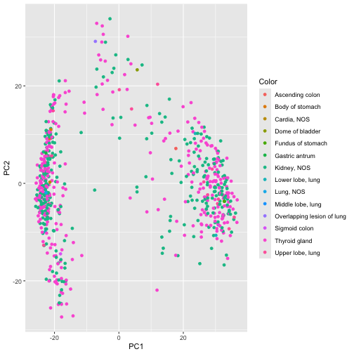
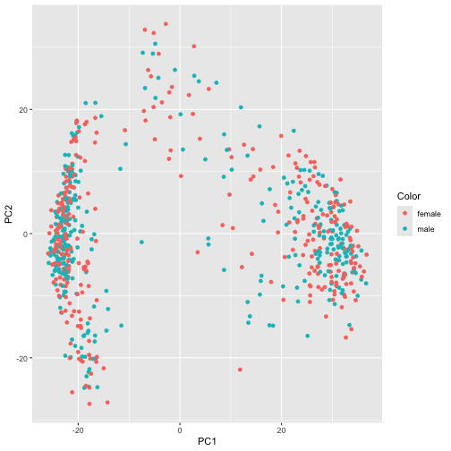
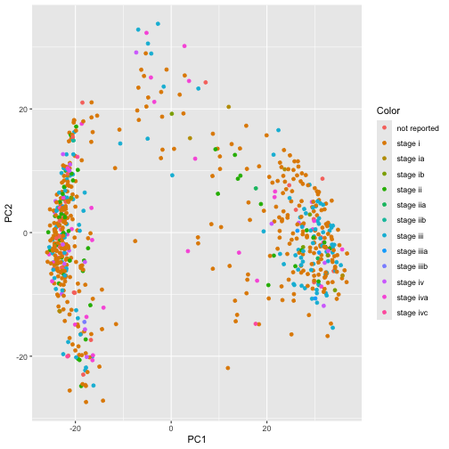
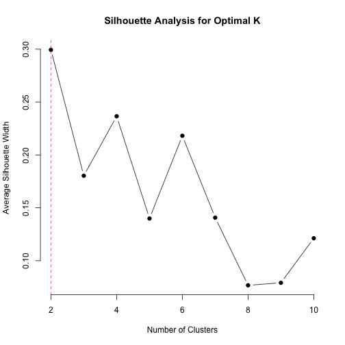
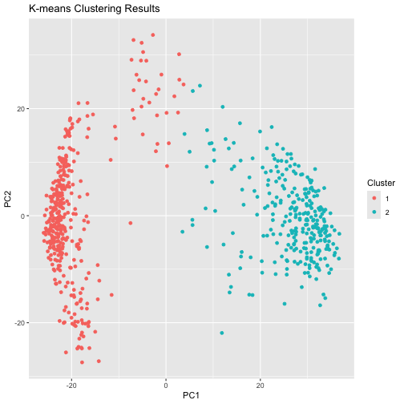

Load Data
=============================
**Description:** Loads the TCGA RNA_seq data and the associated clinical metadata from CSV files.

**Inputs:**

RNAseq_path: Path to the CSV file containing the RNA-seq data.

Clinical_path: Path to the CSV file containing the clinical metadata.


**Outputs:**

data: List object containing the RNA-seq dataframe and the clinical metadata dataframe.


```r
load_data <- function(RNAseq_path, Clinical_path) {
  rna_df <- read.csv(RNAseq_path, header = TRUE, check.names = FALSE, row.names = 1)
  clinical_df <- read.csv(Clinical_path, header = TRUE, row.names = 1)

   data <- list(rna_df = rna_df, clinical_df = clinical_df)
   return(data)
}
```

**Example:**

```r
library(preprocessCore)
library(ggplot2)
library(cluster)
data <- load_data("~/desktop/Papillary+adenocarcinoma,+NOS_data.csv","~/desktop/Papillary+adenocarcinoma,+NOS_clinical_data.csv")

# Access RNA data frame
rna_data <- data$rna_df

# Access clinical data frame
clinical_data <- data$clinical_df
```


Normalize Data
=============================
**Description:** Normalizes the input RNA-seq data by log2 normalization followed by quantile normalization, and then calculates z-scores for each column.

**Inputs:**

data: Input RNA-seq dataframe.


**Outputs:**

zscore_data: Dataframe containing z-score normalized data.


```r
normalize_and_zscore <- function(data) {
  # Log2 normalize each column
  log2_normalized_data <- log2(data + 1) # Adding 1 to avoid log(0)
  log2_normalized_matrix <- as.matrix(log2_normalized_data)

  # Quantile normalize each column
  quantile_normalized_data <- normalize.quantiles(log2_normalized_matrix, keep.names=TRUE)

  # Convert to z-scores for each column
  zscore_data <- scale(quantile_normalized_data)

  return(zscore_data)
}
```

**Example:**

```r
zscore_data <- normalize_and_zscore(rna_data)
```


Perform Principal Component Analysis
=============================
**Description:** Performs Principal Component Analysis (PCA) on the input normalized RNA-seq data.

**Inputs:**

data: Input normalized RNA-seq dataframe.


**Outputs:**

pca_result: PCA result object.


```r
perform_pca <- function(data) {
  # Extract expression data
  expression_data <- data[,1:ncol(data)]

  # Perform PCA
  pca_result <- prcomp(t(expression_data))
  return(pca_result)
}
```

**Example:**

```r
pca_result <- perform_pca(zscore_data)
```


Optional Data Cleaning
=============================
**Description:** Merges two dataframes based on their row names, keeping only the rows that are present in both dataframes. Then, removes any rows with missing values and sets the row names of the resulting dataframe. Finally, removes the column containing the original row names.

**Inputs:**

df1: First dataframe.

df2: Second dataframe.


**Outputs:**

merged_df: Dataframe containing only rows present in both input dataframes, with missing values removed and row names set accordingly.


```r
remove_unshared_rows <- function(df1, df2) {
  merged_df <- merge(df1, df2, by = "row.names", all = TRUE)
  merged_df <- merged_df[complete.cases(merged_df), ]
  rownames(merged_df) <- merged_df$Row.names
  merged_df <- merged_df[, -1]
  return(merged_df)
}
```

**Example:**

```r
pc_scores <- as.data.frame(pca_result$x[, 1:2])
temp <- remove_unshared_rows(pc_scores,clinical_data)
sorted_pc_scores <- pc_scores[order(rownames(pc_scores)), ]
sort_clincal <- temp[order(rownames(temp)), ]
```


Graph PCA Results
=============================
**Description:** Generates a scatter plot of the PCA results, optionally coloring the points based on the provided clinical metadata and adding labels.

**Inputs:**

pca_result: PCA result object.

color_data: Optional vector for coloring points.

labels: Optional vector of labels for data points.


**Outputs:**

p: Plot object.


```r
graph_pca <- function(pca_result, color_data=NULL, labels=NULL) {
  # Extract PC1 and PC2 scores
  pc1 <- pca_result$x[,1]
  pc2 <- pca_result$x[,2]

  # Create a data frame with PC1 and PC2 scores
  pca_df <- data.frame(PC1 = pc1, PC2 = pc2)

  # Assign color if provided
  if (!is.null(color_data)) {
    pca_df$Color <- color_data
  }

   # If color_data is not provided, assign a default color to pca_df$Color
  else {
    pca_df$Color <- "Patient"
  }
  
  # Plot PC1 vs PC2
  p <- ggplot(pca_df, aes(x = PC1, y = PC2, color = Color))
  p <- p + geom_point()
  p <- p + labs(x = "PC1", y = "PC2")

  # Add labels if provided
  if (!is.null(labels)) {
    p <- p + geom_text(label = labels, vjust = -0.5)
  }

  return(p)
}
```

**Example:**

```r
graph_pca(pca_result)
```



```r
graph_pca(pca_result,sort_clincal$race)
```



```r
graph_pca(pca_result,sort_clincal$vital_status)
```



```r
graph_pca(pca_result,sort_clincal$tissue_or_organ_of_origin)
```



```r
graph_pca(pca_result,sort_clincal$gender)
```



```r
graph_pca(pca_result,sort_clincal$tumor_stage)
```




Perform K-Means Clustering
=============================
**Description:** Performs K-Means clustering on the principal components extracted from PCA, and suggests the optimal number of clusters using silhouette analysis.

**Inputs:**

pca_result: PCA result object.

max_clusters: Maximum number of clusters to consider.


**Outputs:**

kmeans_result: K-Means clustering result (using optimal "k") object.


```r
perform_kmeans_with_silhouette <- function(pca_result, max_clusters) {
  # Extract principal components
  pcs <- pca_result$x

  # Initialize vector to store silhouette widths
  silhouette_widths <- vector(mode = "numeric", length = max_clusters - 1)

  # Calculate silhouette widths for different numbers of clusters
  for (k in 2:max_clusters) {
    kmeans_result <- kmeans(pcs, centers = k)
    cluster_assignment <- kmeans_result$cluster
    sil_obj <- silhouette(cluster_assignment, dist(pcs))
    sil_width <- sil_obj[, "sil_width"]
    silhouette_widths[k - 1] <- mean(sil_width)
  }

  # Find the optimal K based on silhouette analysis
  optimal_k_silhouette <- which.max(silhouette_widths) + 1
  cat("Optimal number of clusters (K) suggested by silhouette analysis:", optimal_k_silhouette, "\n")

  # Plot silhouette widths
  plot(2:max_clusters, silhouette_widths, type = "b", pch = 19, frame = FALSE,
       xlab = "Number of Clusters", ylab = "Average Silhouette Width",
       main = "Silhouette Analysis for Optimal K")
  abline(v = optimal_k_silhouette, col = "red", lty = 2)  # Add a vertical line for optimal K

  # Perform k-means clustering with the optimal K
  kmeans_result <- kmeans(pcs, centers = optimal_k_silhouette)

  return(kmeans_result)
}
```

**Example:**

```r
kmean <- perform_kmeans_with_silhouette(pca_result,10)
```

```
## Optimal number of clusters (K) suggested by silhouette analysis: 2
```




Plot K-Means Clustering Results
=============================
**Description:** Plots the K-Means clustering results on a scatter plot.

**Inputs:**

pca_result: PCA result object.

kmeans_result: K-Means clustering result object.


**Outputs:**

p: Plot object.


```r
plot_kmeans_results <- function(pca_result, kmeans_result) {
  # Extract principal components
  pcs <- pca_result$x

  # Create a dataframe with PC1 and PC2 scores and cluster labels
  df <- data.frame(PC1 = pcs[,1], PC2 = pcs[,2], Cluster = as.factor(kmeans_result$cluster))

  # Plot the clusters
  p <- ggplot(df, aes(x = PC1, y = PC2, color = Cluster)) +
    geom_point() +
    labs(x = "PC1", y = "PC2", color = "Cluster") +
    ggtitle("K-means Clustering Results")

  return(p)
}
```

**Example:**

```r
plot_kmeans_results(pca_result,kmean)
```


